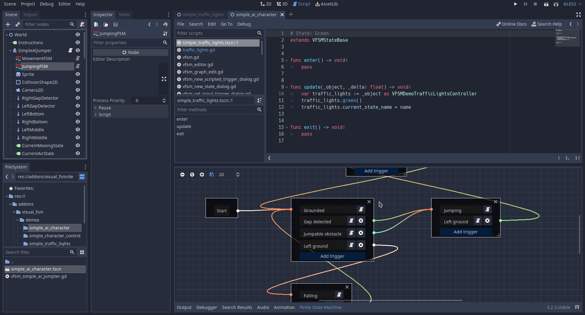

# Warning - I'm not working on this anymore!

I'm not using Godot anymore and further work on this plugin is pretty unlikely. Might get back on it if Godot 4.0 manages to pull me back, but don't count on it! Feel free to clone/fork/modify.

---

# VisualFSM

A visual finite state machine editor plugin for Godot.

## Features

- Visualize and edit your finite state machines with this intuitive editor.
- Trigger based transitions to simplify your states' logic.
- Use prebuilt triggers, or script your own.
- Minimal setup required. Just add a VisualFSM node below the node you want controlled and start building your graph!

## Tutorial
* Add a VisualFSM node as a child to the node you want to control.
* Click on the VisualFSM node: a panel opens in the bottom dock.
* Drag a connection from the start node to create your first state.
* Give it a meaningful name and press enter.
* Click the script icon to edit this state's script. The "object" parameter corresponds to the parent node.
* Click on the "Add trigger" dropdown and select the trigger type.
* A new connection is added to the right of the trigger: drag it to connect to a new state.
* If you added a timer trigger, click on the timer icon to adjust the duration.
* If you added an input action trigger, click on the icon to select the actions to react to.
* If you added a scripted trigger, click on the script icon to edit it. Return true in `is_triggered` when the transition should occur.

## Why another FSM plugin for Godot?

As your finite state machine (FSM) grows, managing transitions between states becomes a pain. This is especially true when states are responsible for triggering their own transitions. This approach violates the [single responsibility principle](https://en.wikipedia.org/wiki/Single-responsibility_principle), since on top of their own control logic they must correctly select the next state. You can easily end up with a messy structure that makes bugs harder to find than they should.

This plugin's main goal is to visually edit your FSM and identify potential problems at a glance. States and their transitions are easily editable in a GraphEdit based editor. Furthermore, your states and transitions are decoupled to allow for a cleaner structure. Each tick, the current state's triggers are visited and the first to fulfill its condition causes the FSM to switch to the corresponding next state.

## Links

Primer on finite state machines and their uses in games: https://gameprogrammingpatterns.com/state.html

The finite state machine implementation was inspired by [this article](https://www.codeproject.com/Articles/1087619/State-Machine-Design-in-Cplusplus-2).
